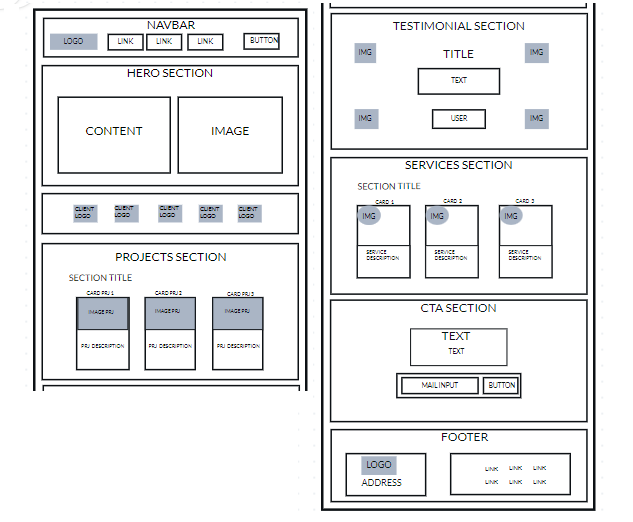
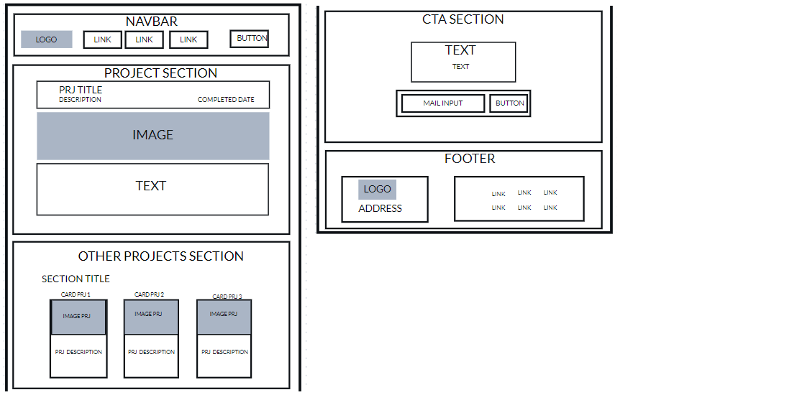
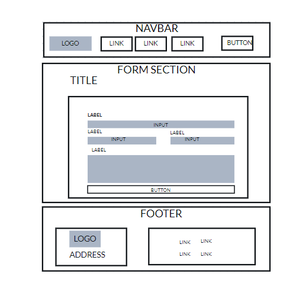

# Circle

## Description

Circle is a simple web made based on a figma design. It has 3 principal pages which are the homepage, projects page and a contact page.

## Technologies

HTML, CSS and Vanilla JavaScript

## Components/features: 

   - Components common to all pages:
       * Navbar: containing the logo and some links to the other pages 
       * Footer:  contains address and (unusable) links

  - Home Page:

      Contains different sections with data about the business. Also fetch info from the API and using DOM manipulation displays 3 proyets in cards in the Recent Proyects section. If you click on the learn more link, you will be redirected to the project page where the project you clicked will be displayed. 
      Clicking the client´s section logo´s will open a new tab with the business webpage. Cta section form will not work
  

   - Project Page:

   Displays a random proyect unless you choose a proyect to display. Also, show cards with other 3 proyects.
   In order to acomplish that, the script fetches the API and saves the received data. The program will then select a random project from the data (unless you have chosen it by clicking on the card´s links) and use DOM manipulation to display it on the first section. Until that is done there will appear a loader (that probably will not be seen because it is not much data so it will be fetched in an instant). The rest of the projects will be filtered with the condition of having a different uuid than the main project and will be displayed in the 3 cards    

   - Contact Page:

   Shows a form with inputs for contact and a textarea for a message. All of them have validation via required atribbute and some of them will display an error message when trying to submit invalid info.
   The form has as method POST, wich would take you to an error page. To prevent that from happening I used method .preventDefault() and after the validation the user is redirected to the Home page

## WIREFRAMES

Home-Page wireframe : 

Project-Page wireframe : 

Contact-Page wireframe : 

## Link

This project has been deployed and you can find it
[here](https://637fc12b42eb3c000997edf0--timely-praline-894034.netlify.app/html/)

Made by leniscervantes
